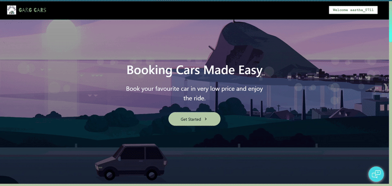
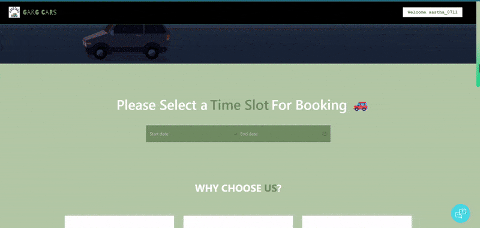
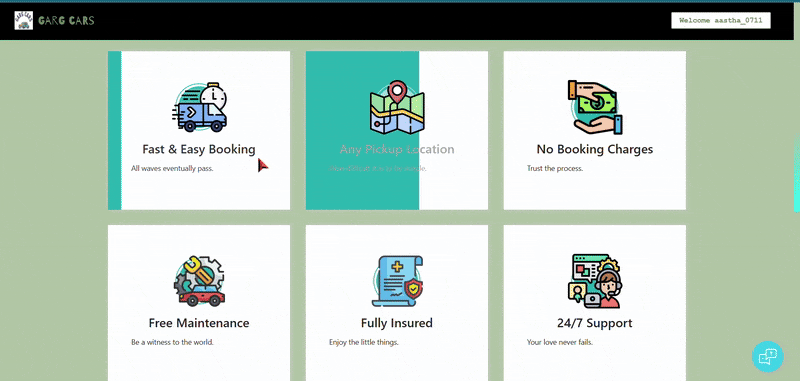
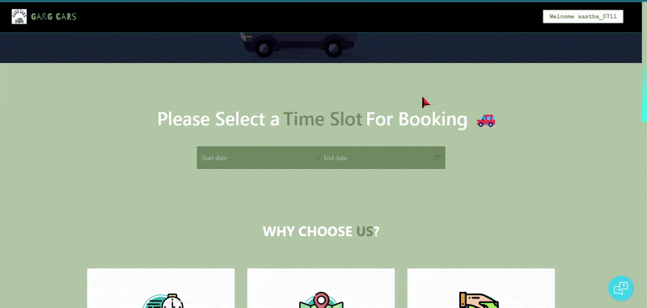
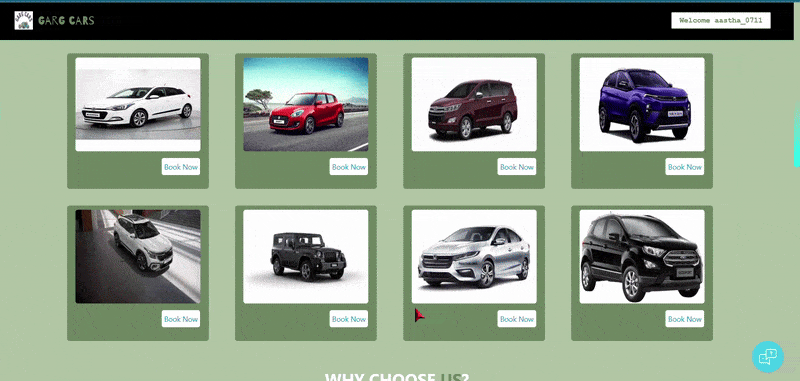
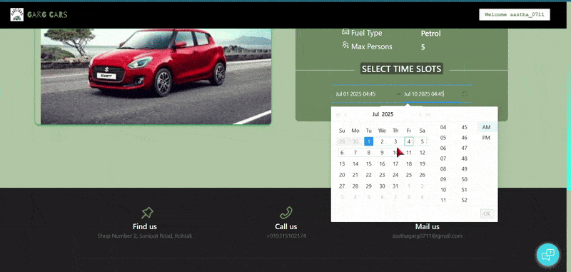
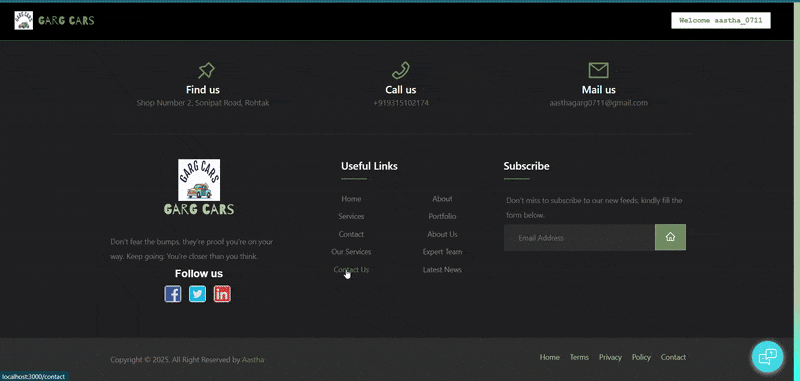
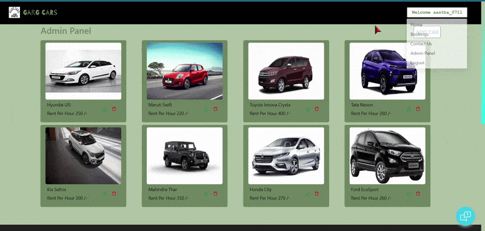

# 🚗 Garg Cars — Modern Car Booking Platform

A sleek and user-friendly car rental web application designed to help users effortlessly book cars at competitive prices. Powered by React, Node.js, MongoDB, and integrated with Stripe for secure, seamless payments.

---

## ✨ Features

- 🚙 Browse a diverse selection of cars  
- 📅 Book cars with real-time availability and calendar slots  
- 🔒 Secure payment processing via Stripe  
- 🛠️ Admin dashboard for managing bookings and inventory  
- 📧 Contact form with email support via EmailJS  

---

## 🎬 Demo Walkthrough

Experience the core functionality through these demo videos:

| Feature               | Preview                                       |
|-----------------------|----------------------------------------------|
| 🏠 Home Page           |                         |
| 🚘 Walk Through        |                 |
| 📅 Booking Conditions  |                       |
| 💳 Time Slot Selection  |                       |
| 🔐 Booking Overview      |                          |
| 🧾 Payment Overview    |                      |
| 🛠️ Contact Admin       |                         |
| 📬 Login,Signup & Admin Panel |                       |

---

## 🛠️ Tech Stack

| Layer         | Technologies                       |
|---------------|----------------------------------|
| **Frontend**  | React.js, Ant Design, Styled Components |
| **Backend**   | Node.js, Express.js               |
| **Database**  | MongoDB                          |
| **Payments**  | Stripe                          |
| **Email**     | EmailJS                         |

---

## 🚀 Installation & Setup

### 1. Clone the repository

```bash
git clone https://github.com/yourusername/garg-cars.git
cd garg-cars
